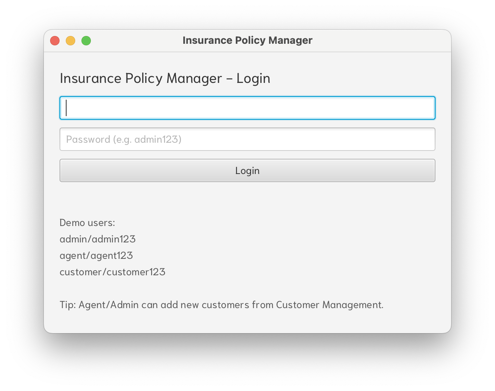
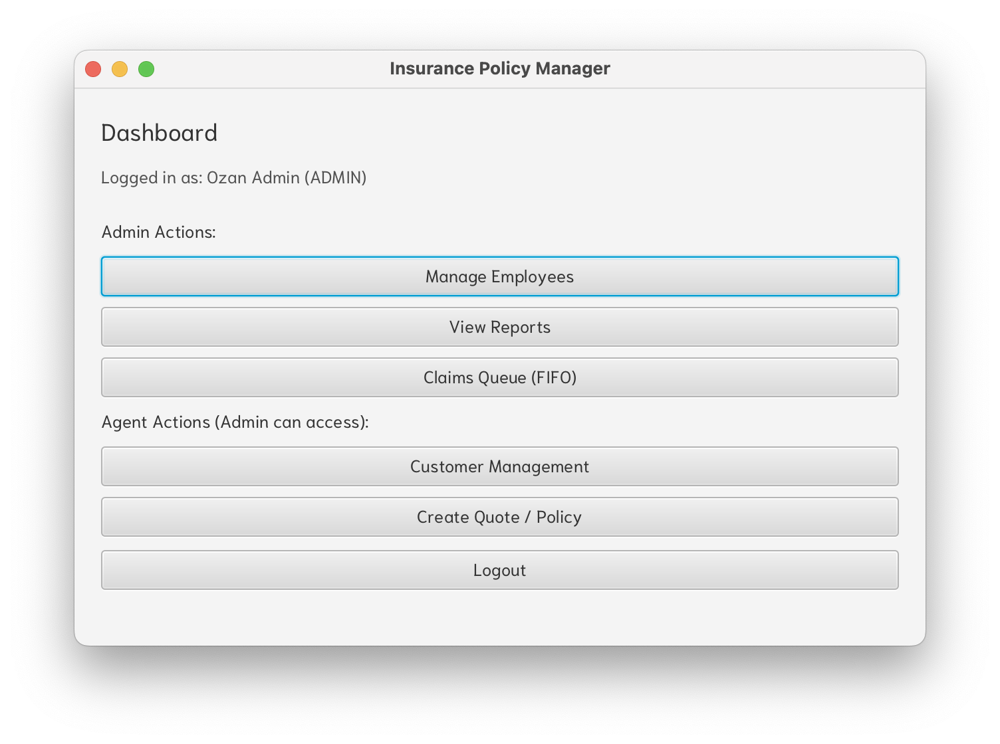
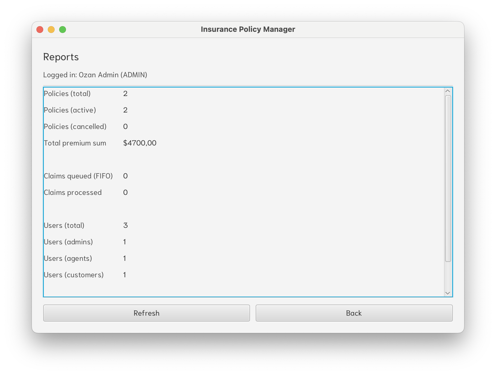
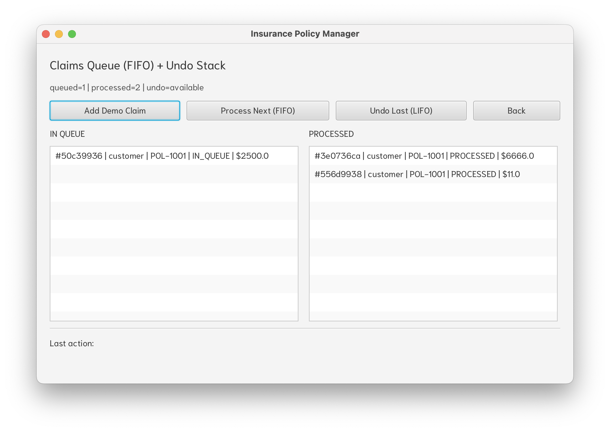

# Insurance Policy Manager (JavaFX + Maven)

A simple **role-based insurance management demo** built with **Java 17**, **JavaFX**, and **Maven**.
Designed as a portfolio/CV project to showcase:
- **OOP + layered architecture**
- **Role-based UI flow**
- **Data structures in real use cases**
  - **Queue (FIFO)** for claim processing
  - **Stack (LIFO)** for Undo actions

---

## Roles & Features

### Customer
- **My Policies**
  - View own policies
  - Cancel selected policy
  - Undo last action (LIFO)
- **Create Claim**
  - Submit a claim for a policy (goes into FIFO queue)

### Agent
- **Customer Management**
  - Add / delete customers
- **Create Quote / Policy**
  - Create policies for customers
  - Undo last action (LIFO)
- **Claims Queue (FIFO)**
  - Process claims in FIFO order
  - Undo last processed claim (LIFO)

### Admin
- **Manage Employees**
  - Add / delete agents
- **View Reports**
  - Policies summary (total/active/cancelled + premium sum)
  - Claims summary (queued/processed)
  - Users summary (by role)
  - Undo stack stats
- Admin can also access Agent features.

> Note: **Undo history is session-scoped** and cleared on logout (for security).

---

## Tech Stack
- Java 17
- JavaFX
- Maven
- Eclipse IDE

---

## Project Structure (Layered)
- `model` → domain entities (User, Policy, Claim, etc.)
- `repository` → in-memory repositories
- `service` → business logic (Auth, Policy, Claims, Undo)
- `ui` → JavaFX screens (Views)

---

## How to Run

### Requirements
- Java 17 installed
- Maven installed (or Maven Wrapper if available)

### Run (recommended)
From project root (where `pom.xml` is):
```bash
mvn clean javafx:run
```

---

## Screenshots
Images are stored under `screenshots/`.

### Login


### Admin Dashboard


### Admin Reports


### Claims Queue (FIFO) + Undo (LIFO)


---

## Demo Users
You can login with:
- `admin / admin123`
- `agent / agent123`
- `customer / customer123`

You can also create new users:
- Admin → **Manage Employees** (add agents)
- Agent/Admin → **Customer Management** (add customers)

---

## Data Structures Highlight

### FIFO Queue (Claims)
Claims are submitted by customers and processed by agents/admins in **first-in-first-out** order.

### LIFO Stack (Undo)
Actions like policy cancellation and claim processing register an undo operation on a **stack** (last action undone first).

---

## Notes / Future Improvements (Optional)
- Persist data (replace in-memory repositories with DB)
- Stronger authorization checks
- Improved UI styling and validation
- Export reports, search/filter lists, etc.
